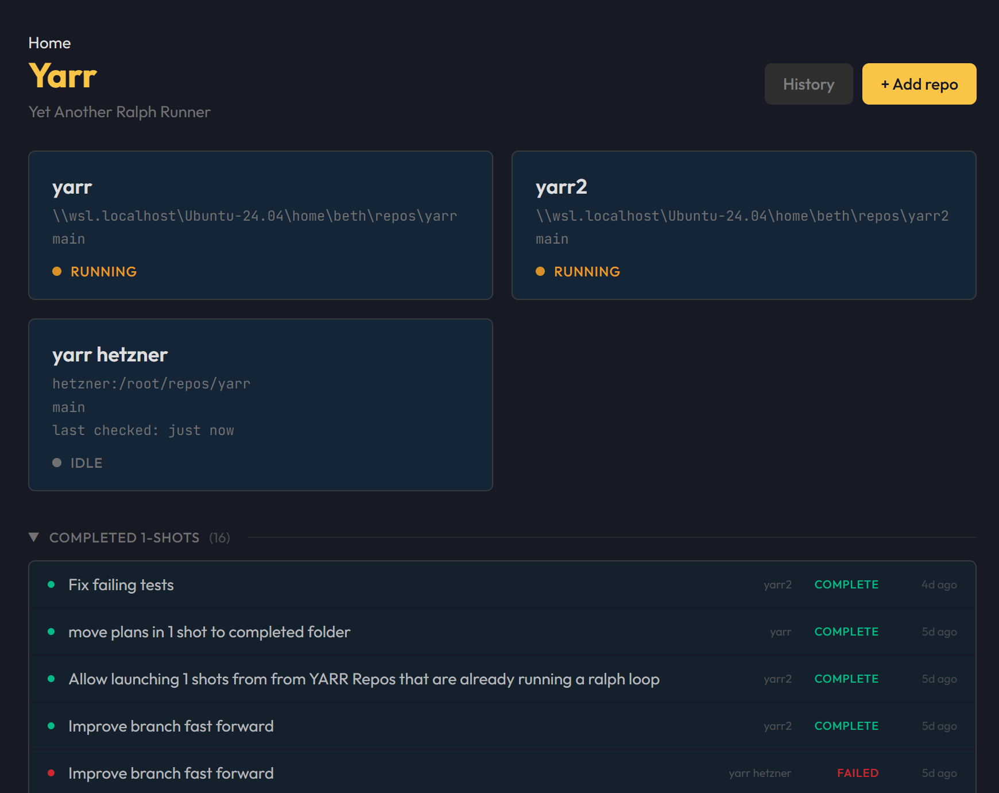
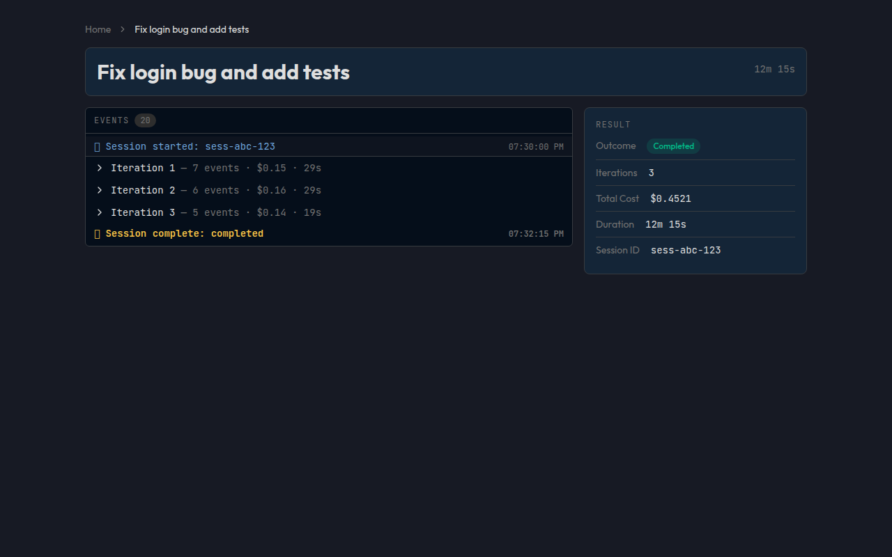

# Yarr — Yet Another Ralph Runner

Every repo ends up with its own scripts for running [Claude Code](https://docs.anthropic.com/en/docs/claude-code) in a loop — parsing `claude -p` output, wiring up checks, tracking token spend. Same boilerplate, slightly different each time.

Yarr replaces all of that with a single desktop app. Write your plan, point Yarr at a repo, hit start. Built-in prompts handle the orchestration so you don't need to configure anything to get going.

A [Ralph loop](https://ghuntley.com/ralph/) is the pattern of running `claude -p` autonomously in a loop against a codebase with a plan. Yarr manages that loop for you.

Uses your existing Claude subscription auth. No API keys needed.

<p align="center">
  
</p>

## Features

- **Works out of the box** — default prompts get you running immediately. Write a plan, pick a repo, start. Customize prompts and checks when you need to.
- **Multiple repos at once** — one dashboard for all your repos, running in parallel. The multi-repo view you wish your terminal had.
- **Real-time cost and context tracking** — token counts, dollar spend, and context window usage per iteration.
- **Checks between iterations** — define shell commands (lint, tests, type checks) that run after each Claude pass. Failures get fed back to Claude automatically.
- **Git automation** — branch creation, auto-push, and merge conflict resolution handled by Claude.
- **One-shot mode** — single-purpose runs with a design phase followed by implementation. Resume on failure.
- **Full session traces** — every run writes a JSON trace to `./traces/`. Browse past runs in the built-in history view.
- **Cross-platform** — Windows (WSL), macOS, Linux. Local repos and SSH remotes.

<p align="center">
  
</p>

## Workflow

1. Add a repo (local path or SSH remote) and point it at a plan file — a markdown doc describing what to build.
2. Hit start. Yarr spawns `claude -p` and streams events to the UI in real time.
3. After each iteration, configured checks (tests, lint, etc.) run automatically. Failures get fed back to Claude for fixing.
4. The session ends when Claude signals completion, hits your iteration limit, or you stop it.
5. Review the full trace in the history view.

## Configuration

**Plans** — Yarr looks for `.md` files in `docs/plans/` by default. Write a plan describing what to build, select it in the UI, and Yarr handles the rest. The plans directory is configurable per repo. Optionally, completed plans auto-move to a `completed/` subfolder.

**Prompts** — Built-in prompts handle design and implementation phases out of the box. To customize, drop your own prompts at `.yarr/prompts/design.md` and `.yarr/prompts/implementation.md` in your repo.

**Checks** — Add shell commands (e.g. `npm test`, `cargo check`) that run between iterations. When a check fails, the output gets fed back to Claude for automatic fixing.

## Getting Started

### Prerequisites

- [Node.js](https://nodejs.org/) 18+
- [Rust](https://rustup.rs/) (stable toolchain)
- [Claude Code](https://docs.anthropic.com/en/docs/claude-code) installed and authenticated
- Platform-specific Tauri v2 dependencies — see [Tauri prerequisites](https://v2.tauri.app/start/prerequisites/)

### Install and run

```bash
git clone <repo-url> && cd yarr2
npm install
npx tauri dev
```

## Development

```bash
npx tsc --noEmit          # Type checking
npx eslint .              # Lint
npx prettier --check .    # Format check
npm test                  # Frontend unit tests (Vitest)
npm run test:e2e          # E2E tests (Playwright)
cd src-tauri && cargo check && cargo test  # Rust
```